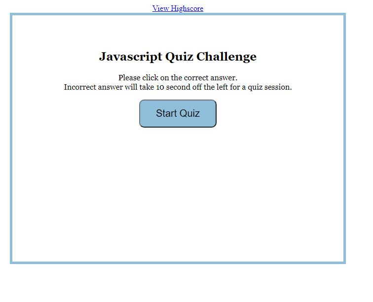
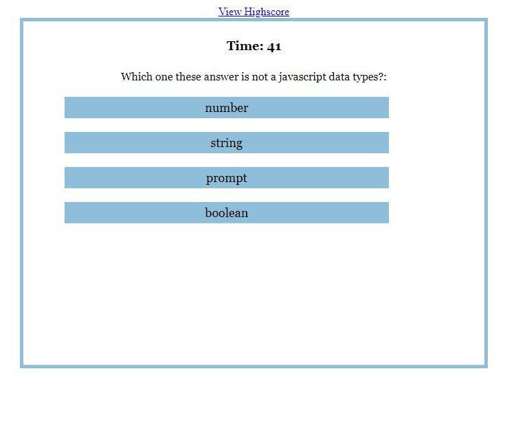
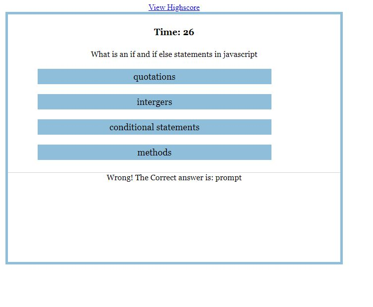
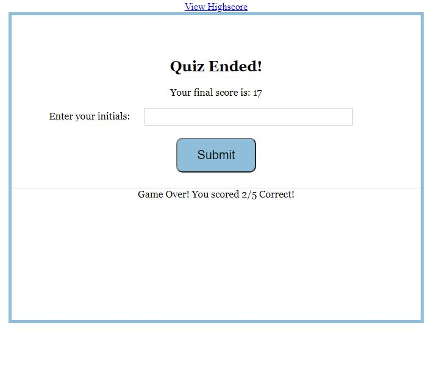
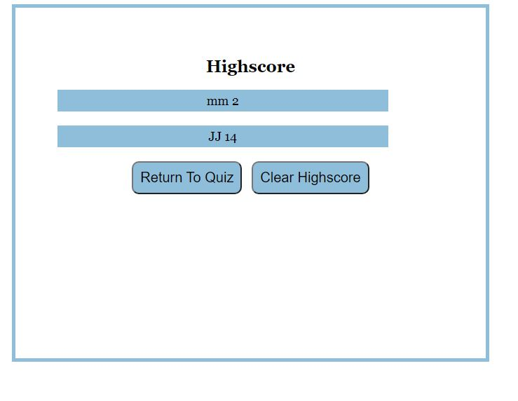

# code-quiz-app

## Task Description

I will build multiple-choice questions and interactive coding challenges.
When the user will press start , he will be presented with the multi choice questions.
The user will have time to answer these questions . Incorrect answer will subtract time from the clock.
When the time reaches 0, the game will be over and the user will be presented with its total score.
The user will be able to save and see all its previous scores.

## Pseudo code description

- Click on a button to present multi-choice questions and the timer starts.

- if the answer is right , save the score and go to the next question.

- if the answer is wrong , reduce the timer and go to the next.

- if timer decrementing is equal to zero then no more questions.

- Result was shown and the user asked if he wanted to save the result.

- if the user wants to save the result - he needs to enter his initial.

- if the result is saved , the previous result can be viewed by pressing a button .

## Git Repository

I created a git repository folder that will host the finish website. The Repository will be found [here](https://github.com/pfansi/code-quiz-app)

## What have you done

- Created a readme.md file to describe the different building phases of the application.

- breaked down the app functionality using pseudo code language.

- created an index.html, a css file, a javascript file.

- Index and highscore html structure created.

- Page styled on an external css sheet.

- variables for the questions defined

- Variables declared for the HTML document DOM

- Function to start and stop the game created

- created a function that will list the question and the answers

## Screenshots

- The user clicks on the button to start a quiz. 

- The user is presented with multi-choice questions . 

- while the timer is running , the App returns a wrong or correct message when the user selects his answer. 

- When the game ends , the user can register his score with his initials. 

- After simitting his initial score the user is now presented with a list of previous scores. 

## Link to the deploy application

https://pfansi.github.io/code-quiz-app/

## link to the git hub repository

https://github.com/pfansi/code-quiz-app
